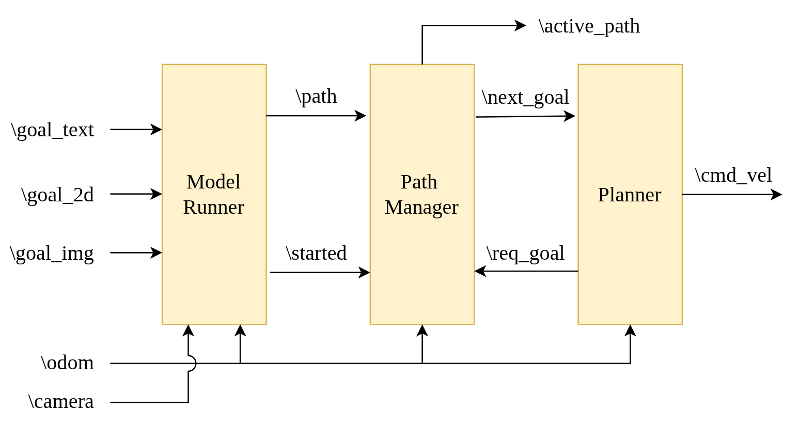

# custom_utils
some common utilities I used across multiple projects
- io_utils: common utilities dealing with taking in, labeling and plotting images
- related to Euclidean Signed Distance Fields (ESDF)

## Deployment Architecture from [CHOP](https://arxiv.org/abs/2603.02004):


- Model Runner is your Inference Policy (i.e. a VLA)
- Path Manager takes a trajectory, and publishes the most relevant waypoint depending on how far you traveled
- Planner is your executer, such as DWA or PID/PD controller

this command can be handy to print out tree structure of your project:
```bash
tree -L 4 -I '.venv|__pycache__'
```
